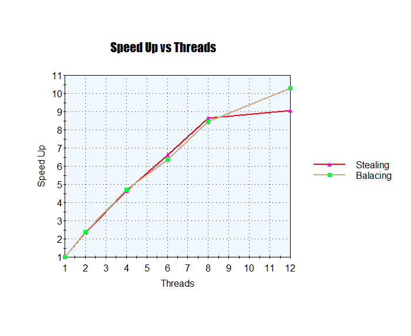

# Parallel Integral Approximation Monte-Carlo Methods

Approxmiates integral for an arbitrary set of bounds in parallel using a work-balancing implementation on an arbitrary number of queues.

## Description

This program (sequentially and in parallel) is used to approximate a integral value of the curve y = x<sup>3</sup> over a set of bounds that the user inputs. It uses the monte-carlo methods to approximate the integral value by selecting points at random and determining if the point lie below the curve.  

Due to the parallelism of the using monte-carlo methods this program has two versions: a sequential and a parallel. In the sequential version the program random selects a large number of points and determines where they lie on a closed interval in R<sup>2</sup>. In the parallel version the program divides the given interval into smaller subintervals (based on user input of number of threads). It then deals out the subintervals to an arbitrary number of queues (based on number of threads) and each queue performs the approximation on its given subinterval. This implementation uses a thread pool the monitors the size of their local queue. If any queue is low on number of tasks the queue preforms the work-balancing act by stealing from another queue with many more tasks.  

## Getting Started

### Dependencies

* [go](https://go.dev/doc/install) must be installed 

### Installing

* Clone program from github

### Executing program

#### Sequential Version
* run the script ./run-program.sh
* Must enter two arguement
    * a: lower bound of integral
    * b: upper bound of integral
```
./run-program.sh $a $b
```
Example below runs the sequential version for approximation the curve y = x<sup>3</sup> over the bounds -2 to 2.
```
./run-program.sh -2 2
```

#### Parallel Version
* run the script ./run-program.sh
* Must enter three arguement
    * threadCount: number of threads you want to use
    * a: lower bound of integral
    * b: upper bound of integral
```
./run-program.sh $threadCount $a $b
```
Example below runs the parallel version for approximation the curve y = x<sup>3</sup> over the bounds 2 to 10 with 4 threads.
```
./run-program.sh 4 2 10
```

### Output

* Standard out output containing:
    * Approximation over the bounds
    * Time it took program to run


## Analysis

The speedup of the parallel version is displayed in the graph below. This is expected since monte-carlo methods tend to be highly parallelizable.


